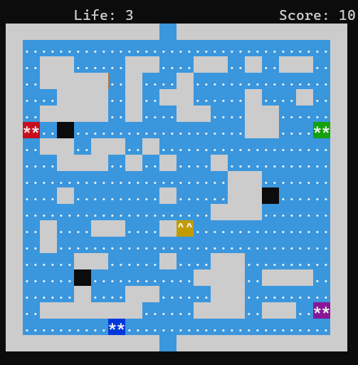

# 🟡 Pacman Terminal Game Project

🎮 **A retro-style Pacman game recreated entirely in the terminal!**  
This project was developed as part of an **Intro to Programming** course, reviving a classic game experience using basic terminal rendering and logic implementation.
---

**Made by:** Ali Kazempour  
**University:** Shahed University  
**Term:** Winter 2022  
**Contact me on Telegram:** [https://t.me/A_Kazempour83](https://t.me/A_Kazempour83)

---

## 🧠 Game Overview

Pacman is a legendary maze arcade game. In this project, we recreate the game for a text-based terminal interface:

- Play as a yellow circle (Pacman 🟡) that eats all the small dots (food) on the map.
- Avoid roaming colored ghosts — if they catch you, the game ends.

 Game inspiration: [Google Pacman Doodle](https://www.google.com/logos/2010/pacman10-i.html)

---

## 🧱 Game Features

### 🎮 Terminal-Based Gameplay

- Fully playable inside a text-based terminal
- No external GUI or graphics libraries needed

### 🗺️ Game Map

- Randomly generated on each game launch
- Includes:
  - Walls (`#`) and walkable paths (`.`)
  - A ghost house where ghosts spawn
  - Regular food pellets
  - Special power pellets in key locations

### 🕹️ Controls
- Use the `W`, `A`, `S`, `D` keys to move Pacman
- Movement continues in the chosen direction until blocked or changed
- Real-time speed control for smooth gameplay

### 👻 Ghost AI

There are **two types of ghosts** in the game — each with different movement logic:

---

#### 🧠 Smart Ghosts
- These ghosts follow Pacman using a **simple but smart algorithm**.
- They compare their position with Pacman's and try to move closer each turn.

**How it works:**
- If Pacman is **below**, move **down**.
- If Pacman is **to the left**, move **left**.
- If the preferred direction is blocked (e.g. wall), try other directions in order of priority.
- The ghost always picks the **first available valid direction** that gets it closer to Pacman.

✅ This makes the game challenging , especially for beginner players.

---

#### 🤪 Dumb Ghosts

- These ghosts move **randomly**, without tracking Pacman's position.
- On each turn, they pick a random direction (up/down/left/right).
- If the direction is blocked, they randomly try others until a valid move is found.

This adds some unpredictability and fun to the game, and helps balance the challenge when mixed with smart ghosts.

### 🏆 Scoring System

- 🍽️ Regular pellet → +10 points
- 🎯 Special pellet → +50 points

---

## 🧩 Game Mechanics

- **Screen Wrapping**: Pacman exits from one side and enters from the other
- **Winning**: Eat all the food
- **Losing**: Get caught by a ghost
- **Lives**: 3 lives per game session
- **Difficulty Modes**: Easy / Medium / Hard

## 🖼️ Screenshot

Here’s a  snapshot of the game in the terminal:

